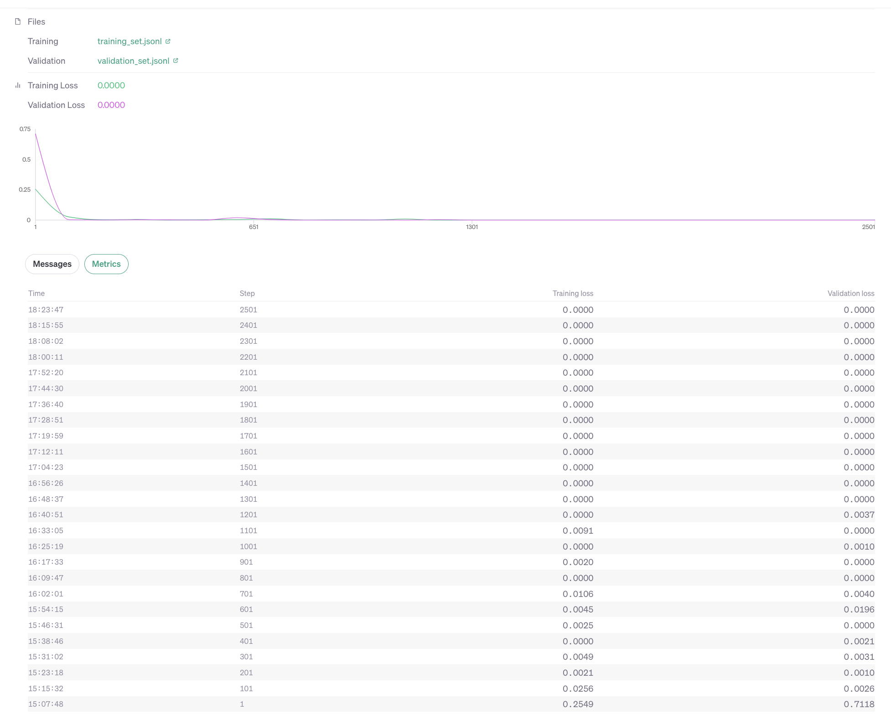

# MathWithLLMs

## Motivation
The current data on the internet for multiplication is like ```a * b = c```. For example if a software engineer wants to mention the number of hours spent coding during their work time, they would do it like ```TotalNumberofWorkDays * Avg Time Spent Each Day Coding``` = ```227 * 4 = 908```. But when humans are asked to calculate ```227 * 4```, we would either use a calculator or we would use the digit wise multiplication using carry method. But when writing the result value on the internet, we don't write down the whole carry based process to multiply the 2 numbers and instead just write down the correct value. The rationale why we do this is because the reader is simply not interested in the whole process and is interested in the final value itself. Given the Data on the internet for math is not procedural or step by step based, LLMs have to reverse engineer the algorithm for math based operators. And given Math is has a definitive process and LLMs are probability based next work token predictors, they often fail in giving correct results related to Math (including the state of the art LLMs). Now given we humans ourselves are doing math using procedural way, not reverse engineer it, why should we except LLMs to reverse engineer the algo for math based operators and instead teach it Math using Procedural way.  

## Related work
* [GPT can do Math without calculators](https://arxiv.org/pdf/2309.03241v2.pdf): This paper is from Tsinghua University. The researchers have trained an LLM from scratch to do only Math. They've given 50M instructions to do Math.
  * Flaws with this paper:
    * Humans don't require 50M instructions to do Math. A child can learn math using a few 100-1000 examples
    * Training an LLM just to do math is incorrect because the concept of LLMs is to create a system which can excel in multiple tasks
* [WizardLM](https://arxiv.org/pdf/2308.09583.pdf): Applied Reinforcement Learning based techniques to do math
* [Goat: Fine-tuned LLaMA Outperforms GPT-4 on Arithmetic Tasks](https://arxiv.org/pdf/2305.14201.pdf): Follows similar approach to the below project but still doesn't do a complete step by step procedure to perform Math

## What this project does?
This project aims to prove that LLMs can learn math when trained on a step by step procedural way similar to how humans do it. And it also breaks the notion that LLMs cannot do Math without using Calculators. For now to illustrate this, this project is restricted itself to only multiplication operation proving how LLMs can learn multiplication. The rationale behind taking multiplication is that Gpt4 cannot do multiplication for >3 digit numbers. We prove that LLMs can do Math when taught using a step by step procedure. For example, instead of teaching LLMs multiplication like ```23 * 34 = 782```, we teach it mutliplication similar to how humans' does using a digit wise multiplication, get values for each digit multiplication and further add the resulting numbers to get the final result. 

**1. Illustration:**

**1.1 How Humans do multiplication:**
<pre>
  23
x 34
_____
  92
 690
_____
 782
</pre>


**1.2 How Dataset was fed to LLM as part of this project:**
  ```
  23 x 34
  = 23 x (4 + 30)

  - First let's multiply by 4.
    - 23 * 4
      - 3 * 4 = 12, carry = 12/10 = 1, remainder1 = 12%10 = 2
      - 2 * 4 = 8, carry = (8 + prevCarry)/10 = (8 + 1)/10 = 0, remainder2 = (8 + 1)%10 = 9
      - Overall Number 1 = [remainder2, remainder1] = 92

  - Let's now multiply by 40
    - 23 * 30 = 23 * 3 * 10
      - 23 * 3
       - 3 * 3 = 9, carry = 9/10 = 0, remainder = 9%10 = 9
       - 2 * 3 = 6, carry = (6+1)/10 = 0, remainder = 6%10 = 6
       - Overall Number 2 = [remainder2, remainder1] * 10 = 690

  - Addition = Overall Number 1 + Overall Number 2 = 92 + 690
    - unit's digits = 2 + 0 = 2
    - ten's digits = 9 + 9 = 18, carry = 1, remainder = 8
    - hundred's digits = carry + 6 = 7, carry = 0, remainder = 7
    - Overall Number = 782
   ```

## 2. Dataset Generation and Training

OpenAI's GPT3.5 was finetuned to teach Math. 

There are close to 1300 multiplication instructions created for training and 200 for validation. The test cases were generated keeping in mind the OpenAI Gpt3.5 4096 token limit. A 5*5 digit multiplication can in general fit within 4096 limit but 6*6 cannot fit. But if 1 number is 6 digit, the other can be <= 4 digit and similarly if 1 number is 7 digit then the other can be <= 3 digit. 

Also instead of giving * for multiplication / + for addition, different operators' ```<<*>>``` and ```<<<+>>>``` are given. The rationale behind this is, using the existing * and + for multiplication and addition might tap on the existing weights of the neural network which doesn't follow step by step instruction and directly give the result for multiplication in 1 single step

**What is the overall training and validation loss when training (finetuning) the model?**

The training loss and validation loss reach near 0 within 100 steps (0.1 epochs) using the gpt3.5-turbo Model. This means that the model is able to follow and understand the procedure. 



## 3. Results

The benchmarking was done on 200 test cases where each test case has 2 random numbers generated. For the 200 samples which were tested, excluding for 3 cases, the rest of the cases the multiplication is correct. **Which means this overall accuracy is 98.5%**. (We're also looking for feedback from community about how to better test)

### 4. Questions

4.1 Why is Finetuning done and why wouldn't few shot prompting work?

A. When initially [tested using incontext learning for Gpt4, the model was able to follow the procedure showed in the 1shot prompting but it was sometimes failing with the overall result due to OpenAI's addition technique](https://chat.openai.com/share/4633c517-edad-420d-8689-36f5c4393557). And given this is a procedural technique, doing a n-shot prompting would lead to even more tokens. Given these limitations, it was evident that finetuning would solve these issue. And also the model was able to quickly learn the procedure and the overall training and validation loss of model went close to 0 within 0.1 epochs

4.2 Why is OpenAI's API used and not an OpenSource LLM?

A. This project is just to prove that LLMs can do Math when taught in a procedural way. And given this is just for proof purposes, proving with the state of the art model would be easier

4.3 How is finetuning Dataset generated?

A. The test cases were generated keeping in mind the OpenAI Gpt3.5 4096 token limit in mind. A 5*5 digit multiplication can in general fit within 4096 limit but 6*6 cannot fit. But if 1 number is 6 digit, the other can be <= 4 digit and similarly if 1 number is 7 digit then the other can be <= 3 digit. There are close to 1300 multiplication instructions created for training and 200 for validation. Although the training/validation set contains all the different digit multiplication possibilities within 4096 Limit, more preference is given to larger digits 

4.4 What can be done better?

A. Find a way to simplify the data instruction size so that token size can be reduced. This simplification has to be done such that overall accuracy of the model is not reduced much

4.5 What are the next steps?

- Reach out to AI and open source community to make this proposal better or identify any flaws
- Do the same process of finetuning using Open Source LLMs
- **Figure out what's the smallest LLM that can do Math accurately when trained in a procedural manner (A 10 year kid can do Math)**. Check this for both normal models and distilled models as well

4.6 Why aren't today's state of the models able to reverse engineer the multiplication algo?

A. Not sure. But my intution is, it's even difficult for a human to do so when not taught in a procedural way. Consider a scenario where a person is not taught multiplication using procedure but just using ```a * b = c```. Just using a bunch of examples, figuring out that the algo is ```digit wise multiplication using carry and further adding up the resulting numbers``` is very difficult for a human. 

4.7 Will scaling the state of the art models further help it in reverse engineering the math algo's?

A. As [Greg Brockman has mentioned during his TED Talk](https://www.linkedin.com/posts/seeall_chatgpt-gpt-gpt4-activity-7054916094439866368-SjgR/), Gpt4 is coming up with an Internal Representation to add 2 40 digit numbers. Similarly, maybe Scaling the current 1T Parameter Models to further might help the model to figure out the multiplication algo when only trained on ```a * b = c``` based examples.
